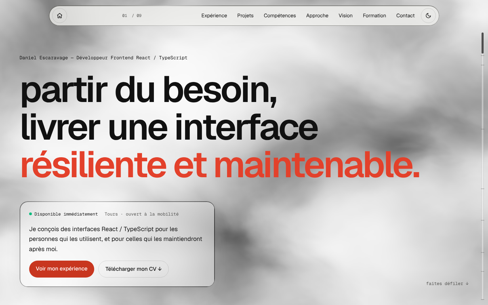

# Portfolio — Dany SK

[](CHANGELOG.md)
[](https://www.dany-sk-fsp.com/)

|              | Intégration continue (CI)                                                                                                                                                                                                                                                | Déploiement continu (CD)                                                                                                                                                                                                             |
| ------------ | ------------------------------------------------------------------------------------------------------------------------------------------------------------------------------------------------------------------------------------------------------------------------ | ------------------------------------------------------------------------------------------------------------------------------------------------------------------------------------------------------------------------------------ |
| **Frontend** | [](https://github.com/DESCARAVAGE/portfolio_up/actions/workflows/ci-frontend.yml)       | [](https://hub.docker.com/r/descaravage/final-project-study-frontend/tags) |
| **Backend**  | [](https://github.com/DESCARAVAGE/portfolio_up/actions/workflows/jest-ci-backend.yml) | [](https://hub.docker.com/r/descaravage/final-project-study-backend/tags)     |

**Version 2** : le frontend est reconstruit avec Next.js. Le détail des versions est dans le [CHANGELOG](CHANGELOG.md).

## 🎯 Pourquoi ce projet

Après 3 années de Faculté de sport, je me suis reconverti dans la programmation — d'abord en autodidacte, puis en suivant des formations de professionnalisation pour des clients et en entreprise.

Ce portfolio répond à un manque concret : l'absence de présence en ligne construite et maîtrisée de bout en bout. Plutôt que de passer par une plateforme clé-en-main, j'ai fait le choix de tout gérer moi-même, « à l'ancienne » : provisionnement et configuration d'un VPS OVH, conteneurisation avec Docker, mise en place d'un reverse proxy, sécurisation du serveur, et supervision manuelle des services — sans dashboard automatisé qui fait le travail à ma place.

L'objectif : démontrer une compréhension réelle de la chaîne complète, du code jusqu'à l'infrastructure qui le fait tourner.

## 🔗 Lien du projet

👉 [www.dany-sk-fsp.com](https://www.dany-sk-fsp.com/)

<picture>
  <source media="(prefers-color-scheme: dark)" srcset="docs/apercu-v2-sombre.png">
  
</picture>

## 🧭 Architecture

```
Visiteur ──HTTPS──▶ Caddy (VPS OVH, certificats TLS)
                      │
                      ▼
                    nginx (passerelle, port 8000)
                      ├── /      ──▶ frontend : serveur Next.js (port 8080)
                      └── /api   ──▶ backend  : API Express (port 3000) ──▶ PostgreSQL 16
```

Chaque service tourne dans son conteneur Docker. Le frontend et le backend sont publiés sur Docker Hub par la CI, puis récupérés par le VPS.

| Dossier                           | Contenu                                       | Gestionnaire |
| --------------------------------- | --------------------------------------------- | ------------ |
| [`frontend/`](frontend/README.md) | Le site (Next.js)                             | pnpm         |
| `backend/`                        | L'API : CV téléchargeable, santé du service   | npm          |
| `nginx.conf`                      | La passerelle entre le frontend et le backend | —            |
| `docker-compose*.yml`             | Développement, production locale, production  | —            |

## 🛠️ Technologies

### Frontend

- **[Next.js](https://nextjs.org/) 16 (App Router, Turbopack) + [React](https://react.dev/) 19 + [TypeScript](https://www.typescriptlang.org/)** — Les sections sont rendues côté serveur au moment du build : la page arrive déjà prête, et seuls les éléments interactifs envoient du JavaScript.
- **[Tailwind CSS](https://tailwindcss.com/) v4** — Styles utilitaires et thème clair / sombre piloté par des variables CSS.
- **[Motion](https://motion.dev/)** — Animations au défilement, qui respectent le réglage « réduire les animations » du système.
- **[Vanta.js](https://www.vantajs.com/) + [Three.js](https://threejs.org/)** — Fond en brouillard 3D interactif, chargé seulement au premier geste du visiteur pour ne jamais ralentir l'affichage.
- **[next-themes](https://github.com/pacocoursey/next-themes)** — Thème clair / sombre synchronisé avec le système.
- **[Playwright](https://playwright.dev/) + [axe-core](https://github.com/dequelabs/axe-core)** — Tests de bout en bout sur ordinateur et mobile, dont l'accessibilité (WCAG 2.2 AA), le téléchargement du CV et le contact.
- **[Lighthouse CI](https://github.com/GoogleChrome/lighthouse-ci)** — Contrôle de la performance, de l'accessibilité et du SEO à chaque build.
- **[pnpm](https://pnpm.io/)** — Gestionnaire de paquets, à la version fixée dans `frontend/package.json`.

### Backend

- **[Node.js](https://nodejs.org/) + [Express](https://expressjs.com/fr/)** — Serveur HTTP léger et flexible, avec un écosystème mature pour construire une API REST rapidement tout en gardant le contrôle sur chaque middleware.
- **[TypeScript](https://www.typescriptlang.org/)** — Typage statique pour fiabiliser le code et limiter les erreurs à l'exécution, particulièrement utile en solo sur un projet qui grandit.
- **[TypeORM](https://typeorm.io/)** — ORM pour gérer les entités et les migrations PostgreSQL sans écrire du SQL brut à chaque requête, tout en gardant la possibilité de descendre au SQL quand c'est nécessaire.
- **[PostgreSQL](https://www.postgresql.org/)** — Base de données relationnelle robuste et éprouvée, adaptée à un modèle de données structuré.
- **[Jest](https://jestjs.io/) + [Supertest](https://github.com/forwardemail/supertest)** — Tests unitaires et d'intégration de l'API, exécutés en CI contre une vraie instance PostgreSQL de test (pas de mock de la base).

### Infrastructure & déploiement

- **[Docker](https://www.docker.com/) / Docker Compose** — Conteneurisation de chaque service (frontend, backend, base de données, passerelle) pour des environnements reproductibles et un déploiement cohérent entre local et production.
- **[Nginx](https://nginx.org/)** — Passerelle interne : `/api` vers le backend, tout le reste vers le serveur Next.js.
- **[Caddy](https://caddyserver.com/)** — Proxy en périphérie avec gestion automatique du HTTPS (certificats TLS renouvelés sans intervention manuelle).
- **[Fail2ban](https://github.com/fail2ban/fail2ban)** — Protection du serveur contre les tentatives de connexion SSH par force brute.
- **VPS [OVHcloud](https://www.ovhcloud.com/fr/)** — Hébergement géré manuellement : configuration système, sécurité et supervision faites à la main plutôt que via une plateforme managée.

## 🔄 CI/CD

- **[GitHub Actions](https://docs.github.com/fr/actions)** — Deux pipelines indépendants, un pour le frontend et un pour le backend, déclenchés uniquement quand le dossier concerné change (pas de build inutile si un seul des deux évolue).
- **[Docker Build](https://docs.docker.com/build/ci/github-actions/)** — Construction et publication des images sur [Docker Hub](https://hub.docker.com/).

Chaque pipeline suit le même principe : **tester avant de construire**.

| Étape           | Frontend ([`ci-frontend.yml`](.github/workflows/ci-frontend.yml))                            | Backend ([`jest-ci-backend.yml`](.github/workflows/jest-ci-backend.yml)) |
| --------------- | -------------------------------------------------------------------------------------------- | ------------------------------------------------------------------------ |
| 1. Contrôles    | ESLint, Prettier, build Next.js (types compris)                                              | Installation des dépendances                                             |
| 2. Tests        | Playwright + axe sur ordinateur et mobile, puis Lighthouse                                   | Jest + Supertest contre un vrai PostgreSQL éphémère                      |
| 3. Image Docker | Sur `main` seulement, si les tests passent : tags `latest`, `2.0.0`, `2.0`, `2` et `sha-…`   | Sur `main` seulement, si les tests passent : tag `latest`                |
| 4. Déploiement  | Le VPS lance `fetch-and-deploy.sh` : récupération des images `latest` et relance de la stack | idem                                                                     |

Ce découplage garantit qu'aucune image cassée n'atteint jamais Docker Hub : si les tests échouent, le build s'arrête avant la publication. Les tags de version permettent de revenir à une version précise en cas de problème.

## 🏷️ Versions

| Version | Frontend                                                               | Statut                  |
| ------- | ---------------------------------------------------------------------- | ----------------------- |
| **2.x** | Next.js 16, Tailwind CSS, brouillard 3D, tests Playwright + Lighthouse | En ligne                |
| 1.x     | React + Vite, MUI, servi par nginx ([aperçu](docs/promo.png))          | Archivée (tag `v1.0.0`) |

La version suit le [Semantic Versioning](https://semver.org/lang/fr/) et se lit dans `frontend/package.json`. Elle s'affiche dans le pied de page du site et sert de tag aux images Docker du frontend. Pour publier une nouvelle version :

1. Mettre à jour la version : `cd frontend && npm pkg set version=2.1.0`
2. Décrire les changements dans le [CHANGELOG](CHANGELOG.md).
3. Merger sur `main`, puis créer le tag Git : `git tag v2.1.0 && git push origin v2.1.0`

## 💻 Lancer le projet en local

Les fichiers `.env.backend`, `.env.db` et `.env.frontend` doivent exister à la racine (ils ne sont pas versionnés).

```bash
# Développement : frontend sur http://localhost:5173, backend sur http://localhost:3001
docker compose up --build

# Production en local : toute la stack derrière la passerelle, sur http://localhost:8000
docker compose -f docker-compose.prod-local.yml up -d --build

# Tests de bout en bout contre la stack complète (y compris le téléchargement du CV)
cd frontend && BASE_URL=http://localhost:8000 pnpm test:e2e
```

En développement, il n'y a pas de passerelle : le lien du CV (`/api/cv/download`) ne fonctionne qu'avec la production locale.

Le détail du frontend (scripts, structure, contenu, tests) est dans [`frontend/README.md`](frontend/README.md).

## 🙏 Remerciements

Merci à la communauté des développeurs et à l'écosystème open source, qui donne accès à des outils puissants et à une documentation permettant d'apprendre en continu — et qui encourage à rester curieux, projet après projet.